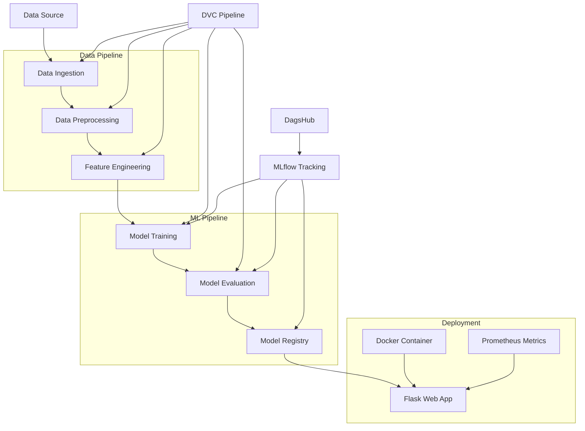

# MLOps Sentiment Analysis Project

A complete MLOps pipeline for sentiment analysis with Flask web interface, MLflow model tracking, DVC data versioning, and Docker deployment.

[](https://python.org)
[](https://flask.palletsprojects.com)
[](https://mlflow.org)
[](https://docker.com)
[](LICENSE)

## Table of Contents

- [Features](#features)
- [Architecture](#architecture)
- [Tech Stack](#tech-stack)
- [Prerequisites](#prerequisites)
- [Quickstart](#quickstart)
- [Installation](#installation)
- [Configuration](#configuration)
- [Database](#database)
- [Running](#running)
- [Docker](#docker)
- [Tests](#tests)
- [CI/CD](#cicd)
- [Deployment](#deployment)
- [Monitoring](#monitoring)
- [Security](#security)
- [Performance](#performance)
- [Troubleshooting](#troubleshooting)
- [Contributing](#contributing)
- [Changelog](#changelog)
- [License](#license)
- [FAQ](#faq)

## Features

- **Complete ML Pipeline**: Automated data ingestion, preprocessing, feature engineering, model training, and evaluation
- **Web Interface**: User-friendly Flask web app for sentiment prediction
- **Model Management**: MLflow integration with DagsHub for experiment tracking and model registry
- **Data Versioning**: DVC pipeline orchestration for reproducible data workflows
- **Containerization**: Docker support for easy deployment and scaling
- **Monitoring**: Prometheus metrics for application monitoring
- **Text Preprocessing**: Advanced NLP preprocessing with NLTK
- **Model Evaluation**: Comprehensive metrics tracking (accuracy, precision, recall, ROC-AUC)

## Architecture



The project follows a modular architecture with clear separation of concerns:

1. **Data Pipeline**: Handles data ingestion, preprocessing, and feature engineering
2. **ML Pipeline**: Manages model training, evaluation, and registry
3. **Web Interface**: Provides user-facing sentiment analysis API
4. **Infrastructure**: Docker containerization and monitoring

## Tech Stack

### Core Technologies
- **Python**: 3.10+ (primary language)
- **Flask**: 3.1.0 (web framework)
- **scikit-learn**: Latest (machine learning)
- **pandas**: 2.2.3 (data manipulation)
- **numpy**: 2.2.1 (numerical computing)

### MLOps Tools
- **MLflow**: 2.19.0 (experiment tracking and model registry)
- **DVC**: Latest (data version control)
- **DagsHub**: 0.4.2 (MLflow hosting)

### NLP Libraries
- **NLTK**: 3.9.1 (natural language processing)
- **CountVectorizer**: Text feature extraction

### Infrastructure
- **Docker**: Containerization
- **Gunicorn**: WSGI server for production
- **Prometheus**: Metrics collection

### Development Tools
- **tox**: Testing framework
- **flake8**: Code linting
- **Make**: Build automation

## Prerequisites

### System Requirements
- **OS**: Linux, macOS, or Windows
- **Python**: 3.10 or higher
- **Memory**: Minimum 4GB RAM
- **Storage**: 2GB free space

### Required Software
- Python 3.10+
- pip (Python package manager)
- Git
- Docker (optional, for containerized deployment)
- Make (for build automation)

### External Services
- **DagsHub Account**: For MLflow tracking (free tier available)
- **AWS S3** (optional): For data storage
- **Internet Connection**: For downloading dependencies and data

## Quickstart

```bash
# Clone the repository
git clone https://github.com/RisAhamed/MLOPS-project-AWS-K8s-Dashgub
cd MLOPS-project-AWS-K8s-Dashgub

# Install dependencies
make requirements

# Run the complete pipeline
python app.py

# Start the web application
cd flask_app
python app.py
```

## Installation

### Linux/macOS

```bash
# Clone repository
git clone https://github.com/RisAhamed/MLOPS-project-AWS-K8s-Dashgub
cd MLOPS-project-AWS-K8s-Dashgub

# Create virtual environment
python3 -m venv venv
source venv/bin/activate

# Install dependencies
pip install -r requirements.txt

# Verify installation
python test_environment.py
```

### Windows

```cmd
# Clone repository
git clone https://github.com/RisAhamed/MLOPS-project-AWS-K8s-Dashgub
cd MLOPS-project-AWS-K8s-Dashgub

# Create virtual environment
python -m venv venv
venv\Scripts\activate

# Install dependencies
pip install -r requirements.txt

# Verify installation
python test_environment.py
```

### Using Make (Recommended)

```bash
# Install dependencies and verify environment
make requirements

# Run linting
make lint

# Clean compiled files
make clean
```

## Configuration

### Environment Variables

Create a `.env` file in the project root:

```bash
# MLflow/DagsHub Configuration
MLOPS_PROJECT=   # Your DagsHub token

# AWS Configuration (Optional)
AWS_ACCESS_KEY= 
AWS_SECRET_KEY = 
S3_BUCKET_NAME= 
S3_DATA_NAME= 

# Flask Configuration
FLASK_ENV=development
FLASK_DEBUG=True
```

### Parameters Configuration

Edit `params.yaml` to customize pipeline parameters:

```yaml
data_ingestion:
  test_size: 0.30
  data_path_url: 'https://raw.githubusercontent.com/vikashishere/Datasets/refs/heads/main/data.csv'
  data_path: './data'

feature_engineering:
  max_features: 20
```

## Database

This project does not require a traditional database. It uses:

- **File-based storage**: CSV files for data storage
- **Model artifacts**: Pickle files for trained models
- **MLflow backend**: SQLite (default) or PostgreSQL for experiment tracking
- **DVC storage**: Local or cloud storage for data versioning

### Data Schema

The sentiment analysis dataset expects:
- **review**: Text content (string)
- **sentiment**: Label ('positive' or 'negative')

### Model Storage

- **Trained models**: `models/model.pkl`
- **Vectorizers**: `models/vectorizer.pkl`
- **Metrics**: `reports/metrics.json`
- **Model info**: `reports/model_info.json`

## Running

### Development Mode

```bash
# Run complete ML pipeline
python app.py

# Start Flask development server
cd flask_app
python app.py
```

### Production Mode

```bash
# Using Gunicorn
cd flask_app
gunicorn --bind 0.0.0.0:5000 --timeout 120 app:app
```

### Individual Pipeline Steps

```bash
# Data ingestion
python src/data/data_ingestion.py

# Data preprocessing
python src/data/data_preprocessing.py

# Feature engineering
python src/features/feature_engineering.py

# Model training
python src/model/model_building.py

# Model evaluation
python src/model/model_evaluation.py

# Model registry
python src/model/model_registry.py
```

### Using DVC Pipeline

```bash
# Run complete DVC pipeline
dvc repro

# Run specific stage
dvc repro data_ingestion
dvc repro model_building
```

## Docker

### Build Docker Image

```bash
# Build the image
docker build -t sentiment-analysis-app .

# Run container
docker run -p 5000:5000 sentiment-analysis-app
```

### Docker Compose (Not Provided)

Create `docker-compose.yml` for multi-service deployment:

```yaml
version: '3.8'
services:
  web:
    build: .
    ports:
      - "5000:5000"
    environment:
      - MLOPS_PROJECT=${MLOPS_PROJECT}
    volumes:
      - ./models:/app/models
      - ./logs:/app/logs
```

### Docker Troubleshooting

**Common Issues:**
- **Port conflicts**: Change port mapping `-p 5001:5000`
- **Model files missing**: Ensure models are built before Docker build
- **Memory issues**: Increase Docker memory limit
- **Permission errors**: Run with `--user $(id -u):$(id -g)`

## Tests

### Running Tests

```bash
# Run all tests
python -m pytest tests/

# Run specific test file
python tests/test_flask_app.py
python tests/test_model.py

# Run with coverage
python -m pytest --cov=src tests/
```

### Test Structure

- **Unit Tests**: `tests/test_model.py` - Model functionality
- **Integration Tests**: `tests/test_flask_app.py` - Web application
- **Environment Tests**: `test_environment.py` - Python environment

### Expected Test Output

```
>>> Development environment passes all tests!
.
----------------------------------------------------------------------
Ran 1 test in 0.001s

OK
```

## CI/CD

### GitHub Actions (Not Configured)

Create `.github/workflows/ci.yml`:

```yaml
name: CI/CD Pipeline

on:
  push:
    branches: [ main, develop ]
  pull_request:
    branches: [ main ]

jobs:
  test:
    runs-on: ubuntu-latest
    steps:
    - uses: actions/checkout@v3
    - name: Set up Python
      uses: actions/setup-python@v4
      with:
        python-version: '3.10'
    - name: Install dependencies
      run: |
        pip install -r requirements.txt
    - name: Run tests
      run: |
        python -m pytest tests/
    - name: Run linting
      run: |
        make lint
```

### Manual CI Checklist

- [ ] Run `make requirements`
- [ ] Execute `python test_environment.py`
- [ ] Run `make lint`
- [ ] Execute `python -m pytest tests/`
- [ ] Test Docker build
- [ ] Verify MLflow tracking

## Deployment

### Local Deployment

```bash
# Production build
cd flask_app
gunicorn --bind 0.0.0.0:5000 --workers 4 --timeout 120 app:app
```

### Docker Deployment

```bash
# Build and run
docker build -t sentiment-analysis .
docker run -d -p 5000:5000 --name sentiment-app sentiment-analysis
```

### Cloud Deployment

#### AWS ECS/Fargate

```bash
# Build and push to ECR
aws ecr get-login-password --region us-east-1 | docker login --username AWS --password-stdin <<REPLACE_ME>>
docker tag sentiment-analysis:latest <<REPLACE_ME>>/sentiment-analysis:latest
docker push <<REPLACE_ME>>/sentiment-analysis:latest
```

#### Google Cloud Run

```bash
# Build and deploy
gcloud builds submit --tag gcr.io/<<REPLACE_ME>>/sentiment-analysis
gcloud run deploy --image gcr.io/<<REPLACE_ME>>/sentiment-analysis --platform managed
```

#### Heroku

```bash
# Deploy to Heroku
heroku create sentiment-analysis-app
git push heroku main
```

## Monitoring

### Prometheus Metrics

The application exposes metrics at `/metrics`:

- **app_request_count**: Total requests by method and endpoint
- **app_request_latency_seconds**: Request latency by endpoint
- **model_prediction_count**: Prediction counts by result

### Logging

Logs are stored in `logs/` directory with rotation:
- **Format**: `[timestamp] logger - level - message`
- **Rotation**: 5MB max size, 3 backup files
- **Levels**: DEBUG, INFO, WARNING, ERROR

### Health Checks

```bash
# Application health
curl http://localhost:5000/

# Metrics endpoint
curl http://localhost:5000/metrics

# Prediction endpoint
curl -X POST http://localhost:5000/predict -d "text=I love this product"
```

## Security

### Environment Variables
- Store sensitive data in `.env` files
- Never commit secrets to version control
- Use environment-specific configurations

### API Security
- Input validation for text preprocessing
- Rate limiting (implement with Flask-Limiter)
- CORS configuration for web requests

### Dependency Security
```bash
# Check for vulnerabilities
pip install safety
safety check

# Update dependencies
pip install --upgrade -r requirements.txt
```

### Secrets Management
- **DagsHub Token**: Store in environment variables
- **AWS Credentials**: Use IAM roles or AWS Secrets Manager
- **Database Credentials**: Use connection pooling and encryption

## Performance

### Optimization Tips

1. **Model Loading**: Models are loaded once at startup
2. **Caching**: Implement Redis for prediction caching
3. **Scaling**: Use multiple Gunicorn workers
4. **Memory**: Monitor memory usage with large datasets

### Scaling Considerations

- **Horizontal Scaling**: Multiple container instances
- **Load Balancing**: Nginx or AWS ALB
- **Database**: Consider PostgreSQL for MLflow backend
- **Caching**: Redis for frequent predictions

### Performance Monitoring

```bash
# Monitor resource usage
docker stats

# Check application metrics
curl http://localhost:5000/metrics | grep app_request_latency
```

## Troubleshooting

### Common Issues

#### 1. MLflow Connection Error
```
Error: MLOPS_PROJECT environment variable is not set
```
**Solution**: Set the DagsHub token in environment variables

#### 2. Model Loading Failed
```
Error: Failed to load model
```
**Solution**: Ensure models are trained before running the app

#### 3. Port Already in Use
```
Error: Address already in use
```
**Solution**: Change port or kill existing process

#### 4. NLTK Data Missing
```
Error: Resource stopwords not found
```
**Solution**: Download NLTK data: `python -m nltk.downloader stopwords wordnet`

### Debug Commands

```bash
# Check Python environment
python test_environment.py

# Verify dependencies
pip list

# Check logs
tail -f logs/*.log

# Test MLflow connection
python -c "import mlflow; print(mlflow.get_tracking_uri())"
```

### Log Analysis

```bash
# View recent logs
ls -la logs/

# Search for errors
grep -i error logs/*.log

# Monitor real-time logs
tail -f logs/$(ls -t logs/ | head -1)
```

## Contributing

### Development Setup

```bash
# Fork and clone repository
git clone https://github.com/RisAhamed/MLOPS-project-AWS-K8s-Dashgub
cd MLOPS-project-AWS-K8s-Dashgub

# Create feature branch
git checkout -b feature/new-feature

# Install development dependencies
pip install -r requirements.txt
pip install pytest pytest-cov flake8
```

### Code Standards

- **Linting**: `make lint` (flake8)
- **Testing**: `python -m pytest tests/`
- **Documentation**: Update README for new features
- **Commits**: Use conventional commit messages

### Pull Request Process

1. Create feature branch from `main`
2. Implement changes with tests
3. Run `make lint` and fix issues
4. Submit pull request with description
5. Address review feedback

### Branch Strategy

- **main**: Production-ready code
- **develop**: Integration branch
- **feature/***: New features
- **hotfix/***: Critical fixes

## Changelog

### Version 0.1.0 (Current)
- Initial release
- Complete ML pipeline implementation
- Flask web interface
- MLflow integration
- Docker support
- Prometheus metrics

### Future Releases
- [ ] CI/CD pipeline
- [ ] Kubernetes deployment
- [ ] Advanced model architectures
- [ ] Real-time streaming
- [ ] Multi-language support

## License

This project is licensed under the MIT License - see the [LICENSE](LICENSE) file for details.

## FAQ

### Q: How do I get a DagsHub token?
A: Sign up at [dagshub.com](https://dagshub.com), create a repository, and generate a token in settings.

### Q: Can I use a different MLflow backend?
A: Yes, modify the MLflow tracking URI in the configuration files.

### Q: How do I add new features to the model?
A: Modify the feature engineering pipeline in `src/features/feature_engineering.py`.

### Q: Is this production-ready?
A: The core functionality is production-ready, but consider adding CI/CD, monitoring, and security enhancements.

### Q: How do I scale this application?
A: Use Docker Swarm, Kubernetes, or cloud services like AWS ECS/Google Cloud Run.

### Q: Can I use different text preprocessing?
A: Yes, modify the preprocessing functions in `flask_app/app.py`.

---

**Maintainer**: Riswan Ahamed  
